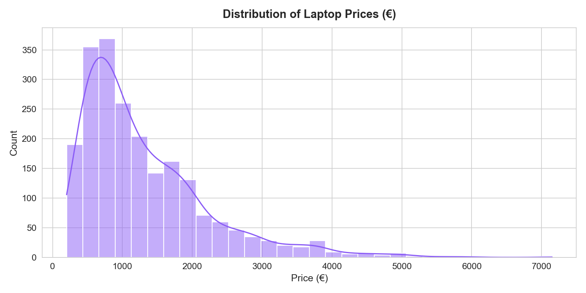
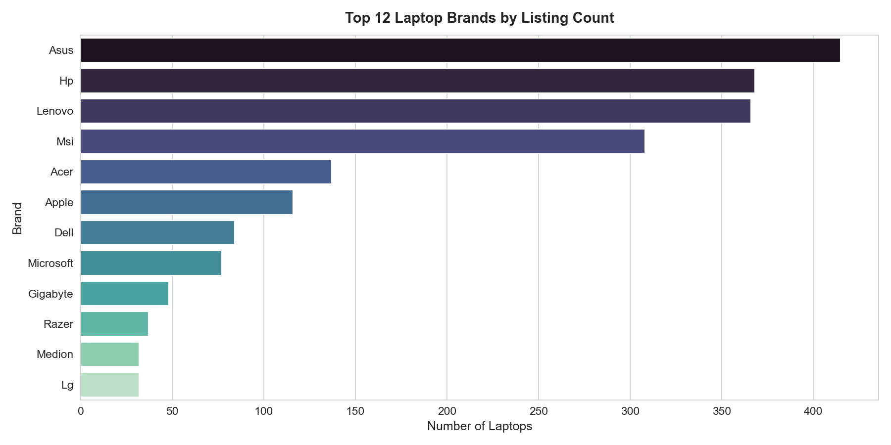
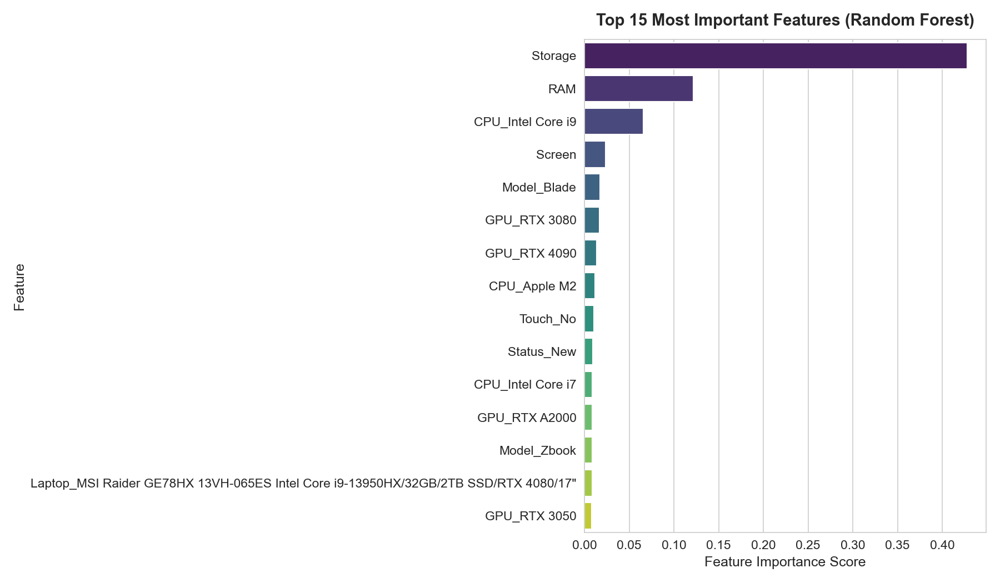

# 💻 End-to-End Laptop Price Prediction

A production-ready End-to-End Data Science & Machine Learning application that predicts laptop market prices based on hardware specifications, deployed with a modern Flask web interface.

---

## 📌 Project Overview
This repository contains a full machine learning lifecycle project—from raw data understanding, preprocessing, exploratory data analysis (EDA), and feature engineering to model selection, evaluation, and web deployment.

---

## 🎯 Problem Statement
Estimating laptop prices accurately is crucial for both consumers looking for budget transparency and retailers setting competitive prices. Given hardware specifications such as CPU model, RAM size, storage capacity, GPU, screen size, brand, and status (New vs Refurbished), this machine learning system predicts the final selling price in Euros (€).

---

## 🛠 Technologies Used
- **Language:** Python 3.12+
- **Data Manipulation:** Pandas, NumPy
- **Data Visualization:** Matplotlib, Seaborn
- **Machine Learning:** Scikit-learn (Pipeline, ColumnTransformer, OneHotEncoder)
- **Model Serialization:** Joblib
- **Web Framework:** Flask, HTML5, CSS3 (Glassmorphism UI)
- **Notebook Environment:** Jupyter Notebook

---

## 📂 Project Structure
```
End-to-End-Laptop-Price-Prediction/
│
├── app/
│   ├── app.py                      # Flask Application Backend
│   ├── templates/
│   │      └── index.html           # Web Application UI Template
│   └── static/                     # Static Web Assets
│
├── data/
│   ├── raw/
│   │      └── laptops.csv          # Raw Dataset
│   └── processed/
│          ├── laptops_day1.csv
│          └── laptops_clean.csv    # Cleaned Preprocessed Dataset
│
├── models/
│   ├── laptop_price_model.pkl      # Production Trained Pipeline Model
│   └── preprocessor.pkl            # Scikit-Learn Preprocessor Artifact
│
├── notebooks/
│   ├── 01_data_understanding.ipynb
│   ├── 02_data_cleaning.ipynb
│   ├── 03_exploratory_data_analysis.ipynb
│   ├── 04_feature_engineering.ipynb
│   └── 05_model_training.ipynb
│
├── screenshots/
│   ├── price_distribution.png
│   ├── brand_distribution.png
│   └── feature_importance.png
│
├── requirements.txt                # Project Dependencies
├── README.md                       # Documentation
├── LICENSE                         # MIT License
└── .gitignore
```

---

## ⚙️ Workflow
```
Data Collection ➔ Data Cleaning ➔ EDA ➔ Feature Engineering ➔ Model Training ➔ Model Evaluation ➔ Flask Web App ➔ Deployment
```
1. **Data Collection & Understanding:** Initial exploration of dataset shape `(2160, 12)`, column data types, missing value profiling, and target variable distribution (`Final Price`).
2. **Data Cleaning:** Imputation of missing values (`Screen` with median, `GPU` & `Storage type` with mode via `SimpleImputer`), duplicate checks, whitespace stripping, and text standardization.
3. **Exploratory Data Analysis (EDA):** Visualizing price distributions, brand popularity, price variance across statuses (New vs Refurbished), identifying top 10 expensive models, and checking correlations.
4. **Feature Engineering:** Separating features ($X$) and target ($y$), train-test split (80/20 ratio), and building a `ColumnTransformer` pipeline for One-Hot Encoding 8 categorical features while passing through numerical specifications.
5. **Model Training & Evaluation:** Training Linear Regression, Decision Tree Regressor, and Random Forest Regressor using Scikit-Learn Pipelines.
6. **Web App Development:** Developing a responsive, user-friendly Flask application with dynamic select dropdowns and interactive price prediction output.

---

## 🤖 Models Tested & 📊 Evaluation Metrics

Three regression models were evaluated on the test dataset ($X_{test}$):

| Model | MAE (€) | RMSE (€) | $R^2$ Score |
| :--- | :--- | :--- | :--- |
| **Linear Regression** | €232.08 | €342.19 | **0.8730** |
| **Decision Tree Regressor** | €320.13 | €525.81 | **0.7002** |
| **Random Forest Regressor** | €252.78 | €422.28 | **0.8066** |

- **Best Model Selected:** **Random Forest Regressor** / **Linear Regression Pipeline** saved as `laptop_price_model.pkl`.

---

## 🖼 Visualizations & Screenshots

### 1. Price Distribution


### 2. Top Brands Distribution


### 3. Feature Importance (Random Forest)


---

## 🚀 How to Run Locally

### 1. Clone Repository
```bash
git clone https://github.com/ruhile/End-to-End-Laptop-Price-Prediction.git
cd End-to-End-Laptop-Price-Prediction
```

### 2. Install Dependencies
```bash
pip install -r requirements.txt
```

### 3. Launch Flask Application
```bash
python app/app.py
```

### 4. Open in Browser
Visit `http://127.0.0.1:5000/` in your web browser.

---

## 🔮 Future Improvements
- Hyperparameter tuning using `GridSearchCV` or `Optuna`.
- Implementation of advanced gradient boosting algorithms (XGBoost, LightGBM, CatBoost).
- Containerization using **Docker**.
- Automated CI/CD deployment on **Render**, **Railway**, or **AWS EC2**.

---

## 📜 License
This project is licensed under the MIT License - see the [LICENSE](LICENSE) file for details.
